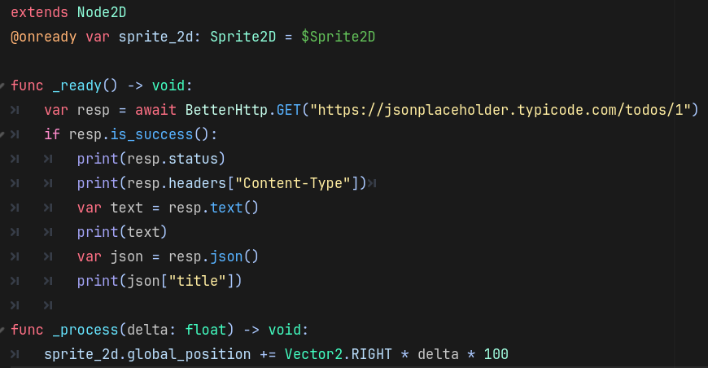
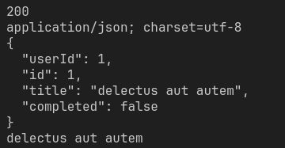

[English](doc/README_EN.md) | 简体中文
# BetterHttp

**BetterHttp** 是一个专为 Godot 4.x 开发的高性能、多线程 HTTP 客户端插件。

它提供了一种现代化的、基于脚本的方式来替代标准的 `HTTPRequest` 节点。通过利用 `WorkerThreadPool` 和底层的 `HTTPClient`，BetterHttp 在后台线程异步执行网络请求，完全不会阻塞游戏主循环，也不需要将节点添加到场景树（SceneTree）中。

## 功能特性

* **真正的多线程**：利用 Godot 的 `WorkerThreadPool` 在后台线程处理 DNS 解析、连接和数据传输。有效防止在执行重度网络操作时出现掉帧。
* **独立于节点**：作为全局单例（Autoload）运行。无需调用 `add_child()`，即可在任何地方（`Node`、`Resource`、`RefCounted` 或其他线程）直接调用。
* **支持 Await**：完美支持现代 GDScript 的 `await` 语法，让异步代码像同步代码一样线性、易读。
* **智能对象池**：内置 `HTTPClient` 实例池，最大限度减少内存分配开销，并降低垃圾回收（GC）压力。
* **类型安全**：返回强类型的 `BetterHttpResponse` 对象，在 Godot 编辑器中提供完整的自动补全和代码提示支持。
* **内置实用工具**：包括自动 JSON 解析、智能 Header 合并以及自动 User-Agent 处理（防止请求被服务器拒绝）。

## 安装步骤

1. 将 `better_http` 文件夹复制到你项目的 `addons/` 目录下。
2. 打开 **项目 (Project)** -> **项目设置 (Project Settings)** -> **插件 (Plugins)**。
3. 启用 **BetterHttp**。
4. **重启编辑器** 以确保 Autoload 单例被正确注册。

## 示例



响应控制台日志：



## 使用方法

### 默认配置

```gdscript
func _ready() -> void:
    # 支持配置默认地址
    BetterHttp.defaults.base_url = "https://jsonplaceholder.typicode.com" 
    # 支持配置全局默认请求头
    BetterHttp.defaults.headers.COMMON["Authorization"] = "Bearer Token" 
    # 支持根据请求方式配置特定的默认请求头
    BetterHttp.defaults.headers.GET["Authorization"] = "Bearer Get Token" 
    BetterHttp.defaults.timeout = 5.0

```

### 拦截器 (Interceptor)

```gdscript
func _ready() -> void:
    var request_interceptor = func(url:String, method, headers, body):
        print("请求 URL: %s" % url)
        print("最终 Headers: %s" % JSON.stringify(headers))
        return url.ends_with("3") # 返回 false 可拦截请求
    BetterHttp.interceptors.use_request(request_interceptor)
    
    var response_interceptor = func(response:BetterHttpResponse):
        print("响应状态码: %s" % response.status)
    BetterHttp.interceptors.use_response(response_interceptor)

    # 移除拦截器
    BetterHttp.interceptors.eject_request(request_interceptor)
    BetterHttp.interceptors.eject_response(response_interceptor)

```

### 基础 GET 请求

```gdscript
func _ready():
    # 返回一个强类型的 BetterHttpResponse 对象
    var response = await BetterHttp.GET("https://jsonplaceholder.typicode.com/todos/1")
    
    if response.is_success():
        # 自动解析 JSON
        var data = response.json()
        print("标题: ", data["title"])
    else:
        push_error("请求失败，错误码: %d" % response.status)

```

### 发送 POST 请求 (带 JSON 载荷)

```gdscript
func send_score():
    var payload = {
        "username": "PlayerOne",
        "score": 9999
    }
    
    # 对于 POST 请求，如果发送的是字典或数组，Content-Type 默认会被设为 application/json
    var response = await BetterHttp.POST("https://api.example.com/scores", payload)
    
    if response.is_success():
        print("分数提交成功。")

```

## API 参考

### 方法 (Methods)

所有请求方法均为异步执行，必须使用 `await`。

* `GET(url: String, query: Dictionary = {}, headers: Dictionary = {}) -> BetterHttpResponse`
* `POST(url: String, data: Variant = null, headers: Dictionary = {}) -> BetterHttpResponse`
* `PUT(url: String, data: Variant = null, headers: Dictionary = {}) -> BetterHttpResponse`
* `DELETE(url: String, query: Dictionary = {}, headers: Dictionary = {}) -> BetterHttpResponse`

### BetterHttpResponse 对象属性与方法

请求返回的 `BetterHttpResponse` 对象包含以下内容：

* **属性：**
* `status` (int): HTTP 状态码（如 200, 404）。
* `headers` (Dictionary): 响应头。
* `_body_raw` (PackedByteArray): 原始响应体数据。
* `_error` (int): Godot 的 `Error` 枚举（如 `OK`, `ERR_TIMEOUT`）。


* **方法：**
* `is_success() -> bool`: 当 `_error` 为 `OK` 且 `status` 在 200-299 之间时返回 `true`。
* `text() -> String`: 将响应体转换为 UTF-8 字符串返回。
* `json() -> Variant`: 将响应体解析为 JSON。解析失败时返回 `null`。

## 开源协议

MIT License。可自由用于个人或商业项目。